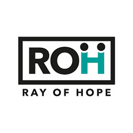
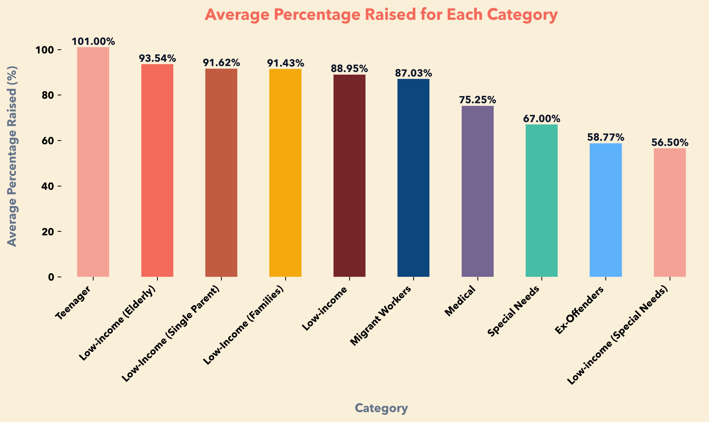
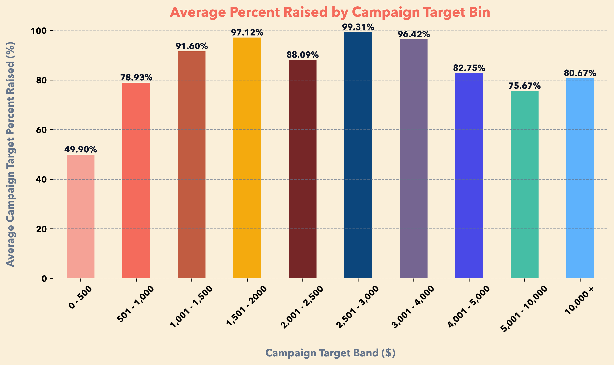
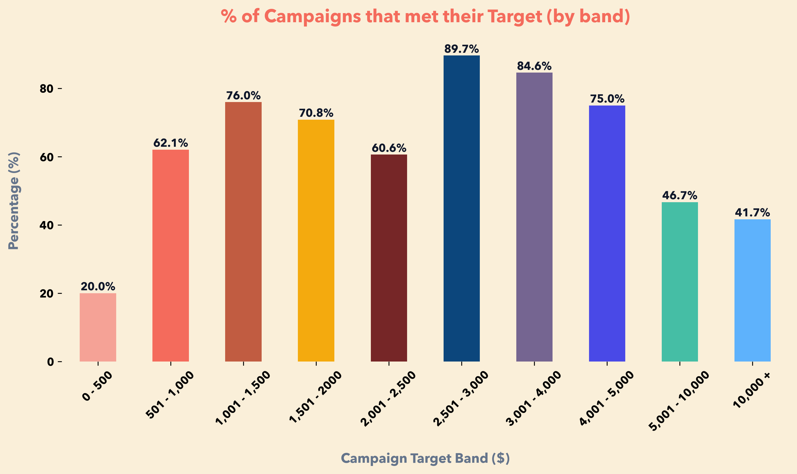
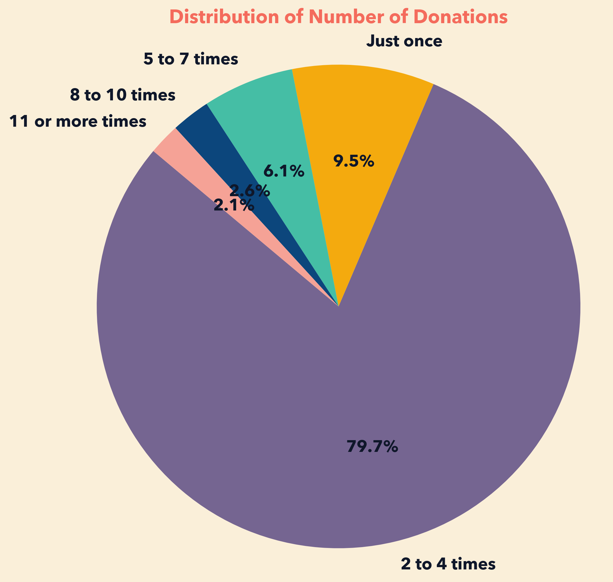
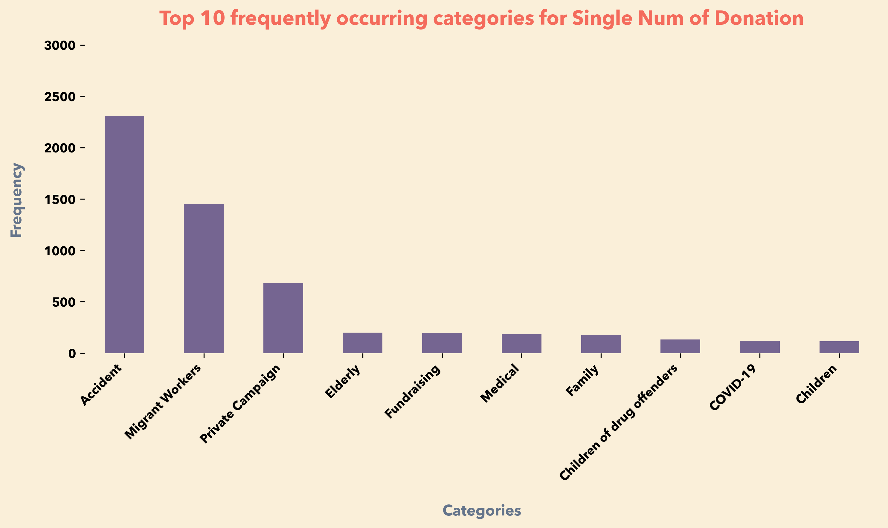

# 
    SG50 Data Analytics Project

    

## About the Project

This project involved collaboration with Ray of Hope, a non-profit organization focused on providing financial assistance to individuals in need. The client have requested us to derive insights from their dataset and provide recommendations for their future Migrant Worker campaigns.

## Project Methodology

The methodology of the study was devised in collaboration with our client, ROH. They provided us with comprehensive data encompassing various aspects of their campaigns, including campaign category,
campaign link, target funds, duration of assistance, funds raised, funds disbursed to beneficiaries, percentage raised, and campaign years.

## Data Preprocessing

Upon receiving the data, it was evident that data cleaning and preprocessing were essential due to numerous missing values, particularly in columns such as campaign target and funds raised.
We engaged in extensive communication with ROH to understand the reasons behind these gaps. Subsequently, we devised strategies to address the missing values, including removing certain rows with missing targets and imputing missing values in funds raised based on data from the funds disbursed column, vice versa.
Additionally, we standardized monetary values by removing commas from the dataset.

## Insights

After preliminary data exploration, we decided to dive deeper to derive insights on the Migrant Worker campaigns of ROH.

The plot shows that ROH have been rather successful in meeting its campaign target for its Migrant Workers campaigns. Among all its Migrant Worker campaigns, it is able to gather around 87.03% of the campaign target fund for the individual Migrant Worker.

We decided to bin the Campaign Target into different bands to see if there are any trends. From the 2 plots above, we discovered that the bands in the middle tend to yield higher average percent raised for the Migrant Worker category. ROH can make use of this information to focus its marketing efforts on other campaign bands that are more difficult to hit the campaign target.

We binned the Number of Donations column into these bands to find out how successful is ROH in retaining its donors and promoting repeated donations. We realised that ROH is doing a great job , with 90.5% of its donar making repeated donations.

We dived deeper into the categories that frequently occur in donars that make single donations. We found out that Migrant Workers appear to be the top 2 category in the donors that made Single donation. We suggest ROH to maybe have a gamification element such that donors might be incentivised to donate.
